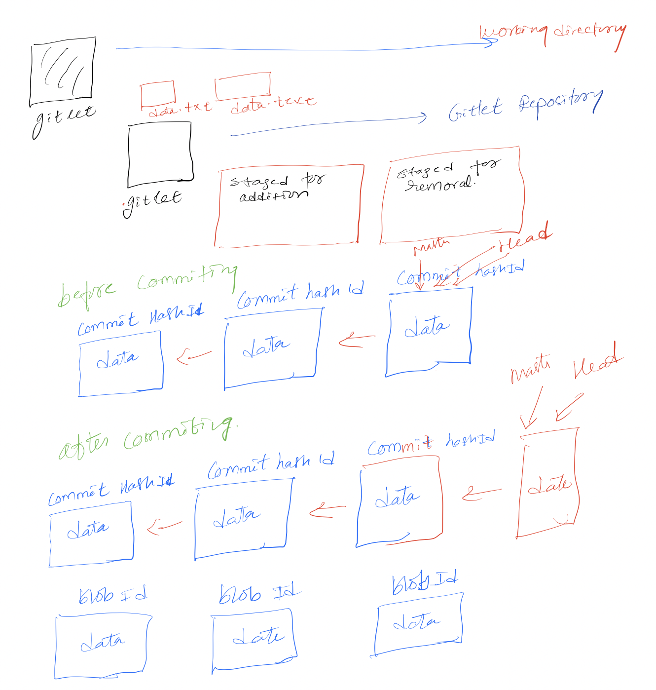

# Gitlet Design Document
author: Nahom Ghebreselasie

## 1. Classes and Data Structures

### Main class
This is the entry point to our program. Make A hashmap in the main  which will keep a track of all the classes we made.

### * Java gitlet.Main init:
init--->
 By typing Java gitlet.Main init, it lets you create in the current directory, a new gitlet version control system.

### * Java gitlet.Main Add [file name]:

Add --> 
By typing Java gitlet.Main Add [file name] it lets you Adds a copy of the file to the staging area as it exists at the moment.

### * Java gitlet commit " ":

commit -->
By typing Java gitlet.Main commit " "it lets you save a files that can later be viewed or restored or edit. 

### * merge :
Files from the provided branch's head are merged into the current branch's head.

### *  log:

Log -- Display details about each commits from initial commit to the current one, starting at the current head pointer.

### * Status:

Status --> Displays the state of the repo and the staging area.

### * gitlet checkout [previous commited adress] or master.

The git checkout command allows you to switch back and forth between the branches
produced by the git branch command. Checking out a branch modifies the files in th
e working directory to match the branch's version, and also notifies Git to keep
track of any new commits.

### * Branch:
Sets the branch's name and a head so that we can maintain track of the current
head commit and subsequently traverse the tree.

### * Blob :
Creates an addressable object for the contents by creating a reference to it.

## 2. Algorithms

### Commit :
We can map the hash id to the blob in the working directory so that we can compare
it to any other hash code in the git repo to check if it's been modified or not; 
If the hash id does not exist in our git repo, we may make a new commit by shifting our
directory to the staging area; after the new commit is made, we can create a new hash 
id to link to it.

  * The head pointer points to the current commit
  * the constructor in the commit has commit id which is generated using SHA-1 HASH VALUES from the utils
  * blob etc
  

## 3. Persistence

Java provides Serialization, Serialization is the process of converting an object into a stream of bytes in order to store 
or transmit it to memory, a database, or a file is known as serialization.
Its main purpose is to save the state of an object so that it can be recreated later.
Deserialization is the opposite of serialization.

###### "Methods that needs to be serialized and deserialize:"
  
* Blob  
* Staging area
* Commit

And Use the Utils provided in the skeleton code to use different methods like readContents, writeObject etc.

## 4. Design Diagram

